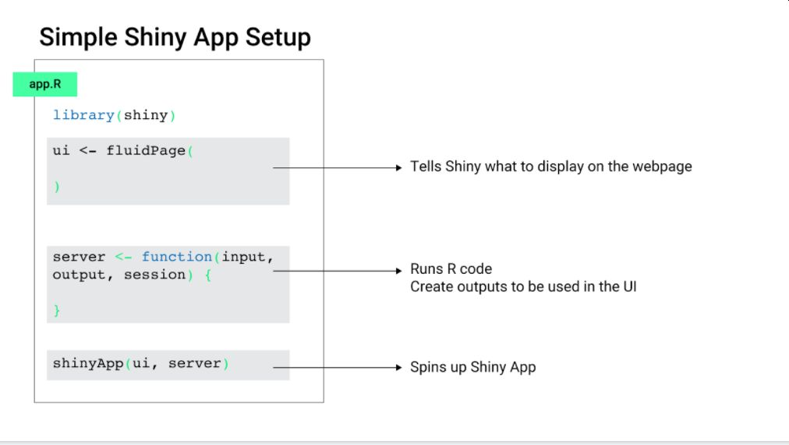

```{r include=FALSE}
library(shiny)
library(ggplot2)
library(tidyverse)
library(flair)
```


## Presentation Structure {data-background=/Users/macbook/Documents/test/rmarkdown/first_test/Occupation_3.png data-background-size=cover }

>- Prepare and import the data; 
>- Build visualization with help of ggplot2 package;
>- Prepare Shiny structure; 
>- Build interactive visualization in shiny using ggplot2 and plotly;
>- Publish Shiny app using https://www.shinyapps.io/. 

## Tourism data {data-background=/Users/macbook/Documents/test/rmarkdown/first_test/Occupation_3.png data-background-size=cover }

- [Georgian National Tourism Administration](https://gnta.ge/statistics/)
- [National Statistics Office of Georgia](https://www.geostat.ge/en/modules/categories/100/tourism-statistics)
- [Georgia inTourismData](https://temurgugushvili.shinyapps.io/tourism_data/)

## ggplot2 {data-background=/Users/macbook/Documents/test/rmarkdown/first_test/Occupation_3.png data-background-size=cover}

## Shiny structure {data-background=/Users/macbook/Documents/test/rmarkdown/first_test/Occupation_3.png data-background-size=cover}



<font size="3"> 
Slide:Ted Laderas [https://bit.ly/bdc_shiny_slides]
</font> 

## Shiny structure {data-background=/Users/macbook/Documents/test/rmarkdown/first_test/Occupation_3.png data-background-size=cover}


<font size="3"> 
Slide:Ted Laderas [https://bit.ly/bdc_shiny_slides]
</font>

## Shiny resources {data-background=/Users/macbook/Documents/test/rmarkdown/first_test/Occupation_3.png data-background-size=cover}

- [Shiny course](https://laderast.github.io/gradual_shiny/)
- [Shiny widgets](https://shiny.rstudio.com/gallery/widget-gallery.html)
- [Shiny examples](https://shiny.rstudio.com/gallery/)

## Thank you | Questions? {data-background=/Users/macbook/Documents/test/rmarkdown/first_test/Occupation_3.png data-background-size=cover}


temur.gugushvili155@sps.tsu.edu.ge 

[temurgugushvili.ge](https://temurgugushvili.ge/)

